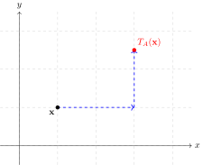
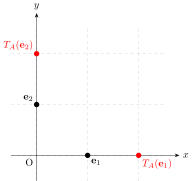
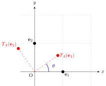
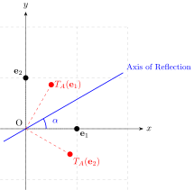
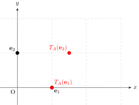
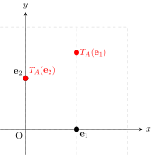
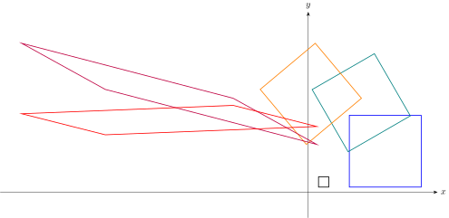

## Introduction

We will explore common affine transformations in Euclidean space in two dimensions, that is $\mathbb{R}^2$.    

## What is a Transformation?

To work out transformations in $\mathbb{R}^2$ it is easier to look at vectors instead of Cartesian points. We note there is a simple isomorphism (or invertible map) between Cartesian points and vectors defined by the mapping
$$
\begin{equation*}
	(x,y) \leftrightarrow	 \begin{pmatrix}
		x \\ y
	\end{pmatrix}.
\end{equation*}
$$

Now let
$$
\begin{equation*}
	\mathbf{x} = \begin{pmatrix}
		x \\ y
	\end{pmatrix}, \quad 	\mathbf{x}_T = \begin{pmatrix}
		x_T \\ y_T
	\end{pmatrix}
\end{equation*}
$$
be two vectors in Euclidean space $\mathbb{R}^2$. We say the point $\mathbf{x}_T$ is a transformation of $\mathbf{x}$ if there exists a function $T: \mathbb{R}^2 \rightarrow \mathbb{R}^2$ such that
$$
\begin{equation*}
	T(\mathbf{x}) = \mathbf{x}_T
\end{equation*}
$$
defined by further functions $T_1: \mathbb{R}^2 \rightarrow \mathbb{R}$ and $T_2: \mathbb{R}^2 \rightarrow \mathbb{R}$ where
$$
\begin{equation*}
	x_T = T_1(x,y), \quad 
	y_T = T_2(x,y).
\end{equation*}
$$

We can transform any set $S \subseteq \mathbb{R}^2$ to the set $S_T \subseteq \mathbb{R}^2$ where
$$
\begin{equation*}
	S _T= \{T(\mathbf{x}) \, | \, \mathbf{x} \in S\} \,.
\end{equation*}
$$

## Types of Transformations

### Linear Transformations

Let $\mathbf{x}, \, \mathbf{y} \in \mathbb{R}^2$ and $a \in \mathbb{R}$ then a linear transformation $T$ satisfies the following two conditions:
1. Homogeneity 
   $$
   \begin{equation*}
		T(a\mathbf{x}) = aT(\mathbf{x})
   \end{equation*}
   $$ 
2. Linearity
   $$
   \begin{equation*}
		T(\mathbf{x}+\mathbf{y}) = T(\mathbf{x}) + T(\mathbf{y})
   \end{equation*}
   $$ 

By these conditions we have the following properties for a linear transformation:
1. The origin $\mathbf{0} = \begin{pmatrix} 0\\0 \end{pmatrix}$  remains fixed
   $$
   \begin{equation*}
		T(\mathbf{0}) = \mathbf{0}.
   \end{equation*}
   $$
2. For $a,\, b \in \mathbb{R}$
   $$
   \begin{equation*}
		T(a\mathbf{x}+b\mathbf{y}) = aT(\mathbf{x})+bT(\mathbf{y})
   \end{equation*}
   $$
3. $T$ is a linear transformation if and only if it can be uniquely represented in matrix form:
   $$
   \begin{equation*}
		T(\mathbf{x}) = A \mathbf{x}
   \end{equation*}
   $$
   where $A$ is a $2 \times 2$ matrix with elements in $\mathbb{R}$, establishing an equivalence between $2 \times 2$ real matrices and linear transformations on $\mathbb{R}^2$.

The first two properties are straightforward to show. Let us show the third property as it will be useful for the examples that follow. First we give the two basis or identity vectors in $\mathbb{R}^2$:
$$
\begin{equation*}
	\mathbf{e}_1 = \begin{pmatrix}
		1 \\ 0
	\end{pmatrix}, \quad 
	\mathbf{e}_2 = \begin{pmatrix}
		0 \\ 1
	\end{pmatrix}
\end{equation*}
$$

Then 
$$
\begin{align}
	T(\mathbf{x}) &= T(x\mathbf{e}_1+ y 	\mathbf{e}_2)  \nonumber \\
	&= xT(\mathbf{e}_1)+yT(\mathbf{e}_2)  \nonumber \\
	&= A \mathbf{x} \label{linear_matrix_transformation}
\end{align}
$$
where $A$ is the 2 by 2 matrix with first column $T(\mathbf{e}_1)$ and second column $T(\mathbf{e}_2)$. We call $A$ the transformation matrix. This means that we can determine any linear transformation by its transformation on the basis vectors. In particular for some of the transformations we will see some geometry is useful to derive $A$ however we will not go into this.

### Affine Transformations

A more general transformation is an affine transformation. It is a linear transformation translated by a constant vector $\mathbf{b}$. Mathematically if $T$ is the affine transformation function then for any $\mathbf{x}$ and constant vector $\mathbf{b}$ independent of $\mathbf{x}$ then
$$
\begin{equation*}
	T(\mathbf{x}) = A\mathbf{x}+ \mathbf{b} \,.
\end{equation*}
$$
where $A$ is the transformation matrix representing the linear transformation \eqref{linear_matrix_transformation}.

#### Affine Transformations with Fixed Points

An affine transformation with fixed points can be defined in two directions. 

**Fixed Point to Standard Form:**
Let $\mathbf{x}_0 \in \mathbb{R}^2$ be a designated fixed point and $A$ be a linear transformation matrix. We can define the affine transformation anchored at $\mathbf{x}_0$ as:
$$
\begin{align}
	T(\mathbf{x}) &= A(\mathbf{x} - \mathbf{x}_0) + \mathbf{x}_0 \nonumber \\
	&= A\mathbf{x} - A\mathbf{x}_0 + \mathbf{x}_0 \nonumber \\
	&= A\mathbf{x} + \mathbf{b}, \label{eqn_affine_standard}
\end{align}
$$
where $\mathbf{b} = \mathbf{x}_0 - A\mathbf{x}_0$. Evaluating this at $\mathbf{x}_0$ gives $T(\mathbf{x}_0) = A\mathbf{x}_0 + \mathbf{x}_0 - A\mathbf{x}_0 = \mathbf{x}_0$, confirming that $\mathbf{x}_0$ is indeed a fixed point. If $\mathbf{x}_0 = \mathbf{0}$, then $\mathbf{b} = \mathbf{0}$ and $T$ reduces to a regular linear transformation.

**Standard Form to Fixed Point:**
Conversely, suppose we begin with a general affine transformation given in standard form:
$$
\begin{equation*}
	T(\mathbf{x}) = A\mathbf{x} + \mathbf{b}.
\end{equation*}
$$
If this transformation possesses a fixed point $\mathbf{x}_0$ satisfying $T(\mathbf{x}_0) = \mathbf{x}_0$, then:
$$
\begin{equation*}
	A\mathbf{x}_0 + \mathbf{b} = \mathbf{x}_0 \implies \mathbf{b} = \mathbf{x}_0 - A\mathbf{x}_0 = (I - A)\mathbf{x}_0,
\end{equation*}
$$
where $I$ is the identity matrix. The fixed point $\mathbf{x}_0$ is **unique** if $I - A$ is invertible. We will not prove this but if  $I - A$ is not invertible there will be a line of fixed points if $I \neq A$ and for $I=A$ all of $\mathbb{R}^2$ are fixed points. For the unique case we have
$$
\begin{equation*}
	\mathbf{x}_0 = (I - A)^{-1}\mathbf{b}.
\end{equation*}
$$
Substituting the above expression for $\mathbf{b}$ back into the general form yields:
$$
\begin{align}
	T(\mathbf{x}) &= A\mathbf{x} + (\mathbf{x}_0 - A\mathbf{x}_0) \nonumber \\
	&= A(\mathbf{x} - \mathbf{x}_0) + \mathbf{x}_0, \label{eqn_affine_fp}
\end{align}
$$
thereby recovering the anchored fixed-point representation.

## Examples of Linear and Affine Transformations

We shall now define some common transformations using the notation above.

### Translation

{width=50%}

A translation is a simple transformation that moves a point or set (or shape) along the $x$ and $y$ axes. It is an affine transformation and can be written simply as
$$
\begin{equation*}
	T_A(\mathbf{x}) = I \mathbf{x} + \mathbf{b} 
\end{equation*}
$$
where $I$ is the 2 by 2 identity matrix (we note as $I\mathbf{x} = \mathbf{x}$ so we need not have written it). It has no fixed point unless $\mathbf{b} = \mathbf{0}$ (i.e. you don't move or the identity transformation) in which case every point is a fixed point. 

### Scaling

{width=50%}

Scaling involves enlarging or shrinking a set (or shape) by a scale factor about a point. It is an example of an affine transformation with fixed points defined as follows. Take any point $\mathbf{x}_0\in \mathbb{R}^2$ then the transformation is defined by \eqref{eqn_affine_fp} with the scaling matrix \eqref{linear_matrix_transformation}
$$
\begin{equation*}
	A = \begin{pmatrix}
		k & 0 \\
		0 & k
	\end{pmatrix} = k I
\end{equation*}
$$
where $k \in \mathbb{R}$ and as before $I$ is the 2 by 2 identity matrix. The scaling transformations for all cases of $k$ are summarised below: 
$$
\begin{equation*}
	\begin{cases}
		k > 1, & \text{Strict enlargement (expansion away from } \mathbf{x}_0\text{)} \\
		k = 1, & \text{Identity transformation (all points invariant)} \\
		0 < k < 1, & \text{Contraction (compression toward } \mathbf{x}_0\text{)} \\
		k = 0, & \text{Collapse (mapping entire space to } \mathbf{x}_0\text{)} \\
		-1 < k < 0, & \text{Inverted contraction (shrinking with point reflection)} \\
		k = -1, & \text{Point reflection/central inversion about } \mathbf{x}_0 \\
		k < -1, & \text{Inverted enlargement (expansion with point reflection)}
	\end{cases}
\end{equation*}
$$
We note that scaling has a single fixed point about the point it is scaled if  $k\neq1$. For $k=1$ we have $A$ is the identity matrix and as mentioned above all points are fixed points. Scaling transformations mean distances between points are scaled by a factor of $|k|$, areas are scaled by a factor of $\det A = k^2$ and in general the shape has the same proportional dimensions. Additionally, the orientation of the shape is preserved when $k > 0$ and reversed when $k < 0$. We note in practice if one were to scale a shape one uses straight lines from the scaling point $\mathbf{x}_0$ through points on the shape and then the scaled shape  lies along these lines. 

### Rotation

{width=60%}

Rotation involves turning a point or set (or shape) by an angle about a point. It is an example of an affine transformation with fixed points defined as follows. Take any point $\mathbf{x}_0$ then the transformation is defined by \eqref{eqn_affine_fp} with transformation matrix \eqref{linear_matrix_transformation}
$$
\begin{equation*}
	A = \begin{pmatrix}
		\cos\theta & -\sin\theta \\
		\sin\theta & \cos\theta
	\end{pmatrix}
\end{equation*}
$$
where $\theta \in [0, 2\pi)$ is the rotation about $\mathbf{x}_0$ anti-clockwise. For rotation, the only fixed point is the point it is rotated around apart from if $\theta=0$ in which case, as before, we have $A$ is the identity matrix and all points are fixed points. Rotation means the shape's dimensions are preserved but it is rotated in space. One could also define the rotation clockwise or for any angle $\theta \in \mathbb{R}$. 

### Reflection

{width=60%}

Reflection involves flipping a point or set (or shape) across a line passing through a point. It is an example of an affine transformation with fixed points defined as follows. Take any point $\mathbf{x}_0$ then the transformation is defined by \eqref{eqn_affine_fp} with transformation matrix \eqref{linear_matrix_transformation}
$$
\begin{equation*}
	A = \begin{pmatrix}
		\cos 2\alpha & \sin 2\alpha \\
		\sin 2\alpha  & -\cos 2\alpha 
	\end{pmatrix}
\end{equation*}
$$
where $\alpha \in [0, \pi)$ represents the angle of the axis of reflection with the positive x-axis passing through $\mathbf{x}_0$. The fixed points are any point lying on the axis of reflection.  Reflection transformations possess several fundamental geometric properties: distances between points and areas are strictly preserved (isometric magnitudes), and absolute angles are preserved. Additionally, the orientation of the shape is strictly reversed.

### Shearing

{width=60%}

{width=50%}

Shearing involves distorting a shape along a given direction such that points are displaced by an amount proportional to their perpendicular distance from a fixed invariant line. It is an example of an affine transformation with fixed points. Taking any point $\mathbf{x}_0 = \begin{pmatrix}
	x_0 \\ y_0
\end{pmatrix}\in \mathbb{R}^2$, the transformation is defined by \eqref{eqn_affine_fp} using a linear shear matrix $A$ \eqref{linear_matrix_transformation}.

A **horizontal shear** parallel to the $x$-axis is defined by the transformation matrix
$$
\begin{equation*}
	A = \begin{pmatrix}
		1 & m \\
		0 & 1
	\end{pmatrix}
\end{equation*}
$$
where $m\in \mathbb{R}$ is the horizontal shear factor, displacing points horizontally based on their $y$-coordinate relative to $\mathbf{x}_0$. The fixed points are all points on the horizontal line $y=y_0$.

Conversely, a **vertical shear** parallel to the $y$-axis is defined by the transformation matrix
$$
\begin{equation*}
	A = \begin{pmatrix}
		1 & 0 \\
		n & 1
	\end{pmatrix}
\end{equation*}
$$
where $n\in \mathbb{R}$ is the vertical shear factor, displacing points vertically based on their $x$-coordinate relative to $\mathbf{x}_0$. The fixed points are on the vertical line $x=x_0$.

## Composition of Transformations

Now, in the Figure below, we illustrate the above by doing the following composition of transformations:

1. [Start with a 2 by 2 square with bottom left corner at $(2,1)$]{style="color: black;"}

2. [Scale by a factor of $k=7$ about $(1,1)$]{style="color: blue;"}

3. [Rotate $30^\circ$ anti-clockwise about $(-5,4)$]{style="color: teal;"}

4. [Reflect by $\alpha = 80^\circ$ about $(2,-1)$]{style="color: darkorange;"}

5. [Shear horizontally by $m=-3$ about $(10,10)$]{style="color: purple;"} and [vertically by $n=0.3$ about $(-10,-10)$]{style="color: red;"}

## Conclusion

In this essay, we introduced the general concept of a transformation and explored several common affine transformations in $\mathbb{R}^2$. Natural extensions of this work include linking these mappings to matrix theory to identify fundamental, atomic transformations that cannot be decomposed into simpler ones and  generalisations to more abstract spaces.