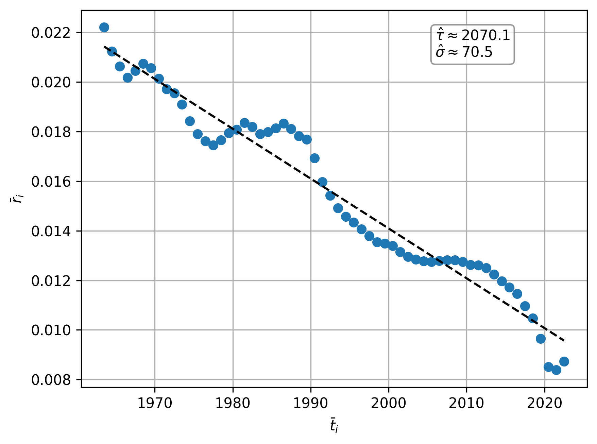
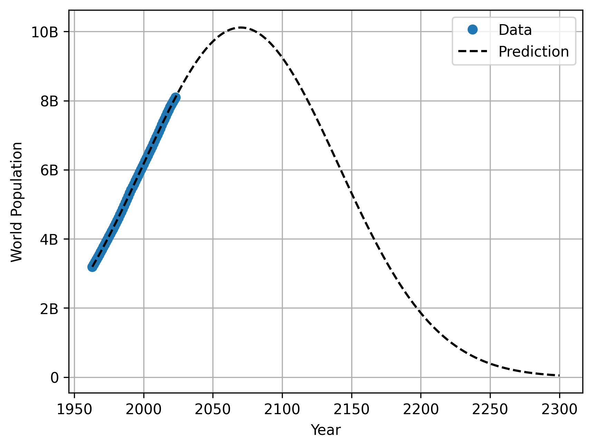

## Introduction

We present a simple model for fitting and predicting world population. Based on a straightforward ordinary differential equation, the model yields a bell-shaped trajectory that has the functional form of a scaled normal distribution.

## Model

Over the time period $(t_0, t_n)$ assume the equation for population $P(t)$ at time $t$ is
$$
\frac{dP(t)}{dt} = r(t)P(t)
$$
where $r(t)$ is the growth rate. This is a first order, linear, separable differential equation with solution
$$
P(t) = P(t_0) \exp \left( \int_{t_0}^{t} r(u) \, du \right), \quad u \in (t_0, t_f).
$$
Note the growth rate can be written as
$$
r(t) = \frac{1}{P(t)}\frac{dP(t)}{dt} = \frac{d}{dt}\log P(t)
$$
We shall see in the next section that the growth rate follows roughly a linear form
$$
r(t) = -\frac{t - \tau}{\sigma^2}, \quad t \in (t_0, t_n)
$$ {#eq-linear_growth_rate}
for the period $(t_0, t_n)$ where the parameter $\tau$ is the shift parameter, and $\sigma$ is the scale parameter. The latest period where the parameters are fixed is roughly the 60 year period from 1963 to the latest year of data 2023. For simplicity we shall only solve for this period and predict the population with these parameters. With this linear growth rate @eq-linear_growth_rate we can solve to find
$$
P(t) = P(t_0) \exp \left( -\frac{1}{2\sigma^2}\left((t-\tau)^2-(\tau-t_0)^2\right)\right), \quad t \in (t_0, t_n).
$$ {#eq-pop_eqn}
We note that the maximum occurs at $t=\tau$ with population
$$
P_{\max} = P(\tau) = P(t_0) \exp\left( \frac{1}{2\sigma^2}(\tau - t_0)^2\right).
$$
From this we note that @eq-pop_eqn equates to the following
$$
P(t) = P_{\max} \exp \left( -\frac{1}{2\sigma^2}(t-\tau)^2\right), \quad t \in (t_0, t_n)
$$ {#eq-pop_eqn1}

We note @eq-pop_eqn1 is symmetric about $t=\tau$ and has the scaled form of the density function of the Normal distribution.
One can find from @eq-pop_eqn1 the inverse where the time $t$ coincides with a given population $P(t)$:
$$
t = 
\begin{cases} 
    \tau - \sqrt{2 \sigma^2 \log \left(\frac{P_{\max}}{P(t)} \right) } & \text{for } t < \tau \\[1.5em]
    \tau + \sqrt{2 \sigma^2 \log \left(\frac{P_{\max}}{P(t)} \right) } & \text{for } t \ge \tau 
\end{cases}
$$
Note for $t \neq \tau$ we have two times the same amount either side of the peak time $\tau$ corresponding to $P(t)$.

## Fitting to Data

We use data 
$$
\{(t_i, P(t_i))\}_{i=0}^n, \quad \text{where } t_0 = 1963, \, t_n = 2023
$$

To align the discrete growth rates with our continuous model, we evaluate them at the interval midpoints:
$$
\bar{t}_i = \frac{t_i+t_{i+1}}{2}, \quad \bar{r}_i = \frac{\log P(t_{i+1}) - \log P(t_i)}{t_{i+1}-t_i}  \quad i = 0, 1, \dots, n-1.
$$
This yields the approximation $\bar{r}_i \approx r(\bar{t}_i)$. We assume the linear relationship @eq-linear_growth_rate
$$
\bar{r}_i = -\frac{\bar{t}_i - \tau}{\sigma^2}, \quad i = 0, 1, \dots, n-1.
$$
Performing linear regression (which will give some bias) we find estimates for $(\tau, P(\tau))$ and $\sigma$ as 
$$
(\hat{\tau}, \, \hat{P}(\hat{\tau})) \approx (2070, \, 10.1 \text{ billion}), \quad \hat{\sigma} \approx 70.5
$$ {#eq-params_pred}

See @fig-filtered_rate below. 
Thus the model predicts a scaling factor of around 70.5 with peak population of approximately 10.1 billion around 2070. Using these parameters we can predict from 1963 forwards in time. In particular, we predict till 2300, see @fig-world_pop_pred. For some particular population milestones we have the predicted time approximations from the model in @tbl-population_milestones.
Naturally, **because growth rates fluctuate and we only predict using the roughly fixed growth rate from 1963--2023**, these milestones carry increasing uncertainty further into the future; nonetheless, it will be revealing to observe whether the overall macro trend holds true.

{#fig-filtered_rate width=80%}

{#fig-world_pop_pred width=80%}

| Population Milestone | Reached on the Way Up | Recrossed on the Way Down |
|:---|:---:|:---:|
| 10.1 Billion (**Peak**) | 2070 | - |
| 10 Billion | 2059 | 2081 |
| 9 Billion | 2036 | 2104 |
| 8 Billion | 2022 | 2118 |
| 7 Billion | 2010 | 2131 |
| 6 Billion | 1998 | 2142 |
| 5 Billion | 1986 | 2154 |
| 4 Billion | 1974 | 2166 |
| 3 Billion | 1960 | 2180 |
| 2 Billion | 1943 | 2197 |
| 1 Billion | 1918 | 2222 |
| 500 Million | 1897 | 2243 |
| 250 Million | 1878 | 2262 |
| 100 Million | 1856 | 2284 |

: Milestone Analysis for Population Model {#tbl-population_milestones}